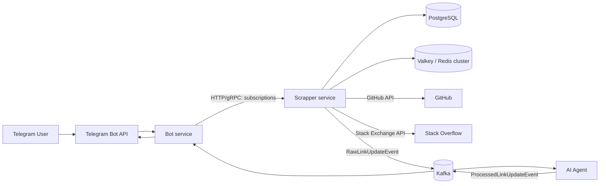
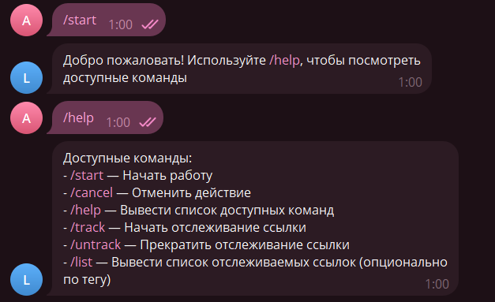
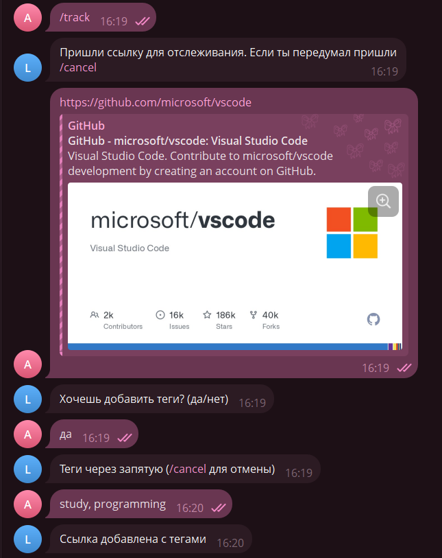
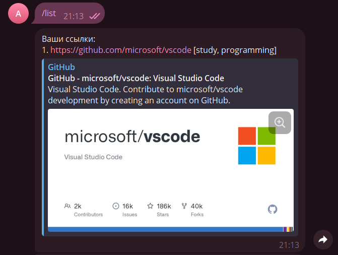
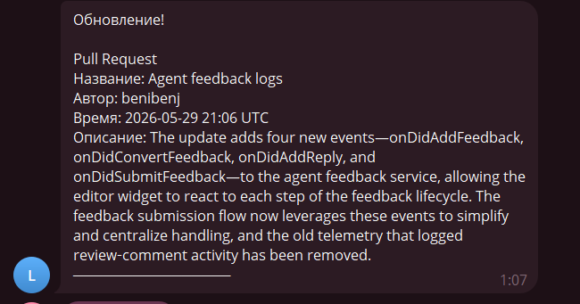

# Link Tracker

Link Tracker is a Telegram bot and a set of backend services for tracking updates on GitHub and Stack Overflow. A user adds a link in the bot, and the system periodically checks the source, processes updates, and sends notifications back to Telegram.

The project is a microservice Java application: Bot handles the Telegram interface, Scrapper stores subscriptions and checks external APIs, AI Agent filters/groups/summarizes updates, and shared HTTP/gRPC/Kafka contracts live in `api-common`.

## Features

- Telegram command support: `/start`, `/help`, `/track`, `/untrack`, `/list`, `/cancel`.
- GitHub repository tracking via the GitHub Issues/Pull Requests API.
- Stack Overflow question tracking, including new answers and comments.
- Tags for subscriptions and link list filtering with `/list <tag>`.
- Update delivery via Kafka with Avro messages and Schema Registry.
- gRPC and HTTP clients between services.
- Outbox pattern for reliable notification delivery from Scrapper.
- Subscription caching via Valkey/Redis cluster and a local L1 cache.
- Rate limiting, retry, and circuit breaker on external and internal calls.
- AI Agent for filtering, prioritizing, grouping, and summarizing updates.

## Architecture



### Modules

| Module | Purpose |
| --- | --- |
| `bot` | Telegram bot, command handling, sending notifications to users |
| `scrapper` | Chat and subscription management, GitHub/Stack Overflow polling, outbox, caching |
| `ai-agent` | Kafka consumer/producer for filtering, grouping, prioritizing, and summarizing updates |
| `api-common` | OpenAPI, protobuf, Avro schemas, and generated shared DTOs/APIs |

## Stack

- Java 25
- Spring Boot 4.0.2
- Maven 3.9.12
- PostgreSQL 17
- Liquibase
- Confluent Platform 8.2.0: Kafka + Schema Registry
- Avro
- gRPC / Protobuf
- OpenAPI / Springdoc
- Valkey 8.0 / Redis-compatible cluster
- Resilience4j
- WireMock
- Testcontainers

## Quick Start

### Requirements

- JDK 25
- Docker and Docker Compose
- Telegram bot token from [@BotFather](https://t.me/BotFather)
- GitHub token
- Stack Exchange key and access token
- Hugging Face-compatible API token for AI Agent

### Running with Docker Compose

1. Create a local `.env` from the template:

```powershell
Copy-Item .env.dist .env
```

On Linux/macOS:

```bash
cp .env.dist .env
```

2. Fill in `.env`. Minimal example for Docker Compose:

```dotenv
DB_USER=linktracker
DB_PASSWORD=linktracker
DB_NAME=linktracker
DB_DRIVER=org.postgresql.Driver

TELEGRAM_TOKEN=<telegram-bot-token>
GITHUB_TOKEN=<github-token>
STACKOVERFLOW_KEY=<stackexchange-key>
STACKOVERFLOW_ACCESS_KEY=<stackexchange-access-token>

KAFKA_SCHEMA_REGISTRY_URL=http://schema-registry:8081

HF_API_URL=https://router.huggingface.co/v1/chat/completions
HF_TOKEN=<hf-token>
HF_MODEL=openai/gpt-oss-120b:fastest
```

3. Build and start the project:

```powershell
docker compose up --build -d
```

4. Check that all containers are running:

```powershell
docker compose ps
```

To stop the environment:

```powershell
docker compose down
```

To also remove PostgreSQL/Valkey data:

```powershell
docker compose down -v
```

### Running Locally from IDE or Maven

Start the infrastructure:

```powershell
docker compose up -d postgres liquibase-migrations kafka-1 kafka-2 kafka-3 schema-registry kafka-init valkey-1 valkey-2 valkey-3 valkey-init
```

For running services locally outside Docker, use host addresses:

```dotenv
DB_URL=jdbc:postgresql://localhost:5432/linktracker
KAFKA_BOOTSTRAP_SERVERS=localhost:19092,localhost:29092,localhost:39092
KAFKA_SCHEMA_REGISTRY_URL=http://localhost:8082
REDIS_CLUSTER_NODES=localhost:6379,localhost:6380,localhost:6381
APP_BOT_URL=http://localhost:8080
APP_SCRAPPER_URL=http://localhost:8081
APP_GRPC_HOST=localhost
SPRING_LIQUIBASE_ENABLED=true
```

Generate shared contracts:

```powershell
.\mvnw.cmd -pl api-common -am generate-sources
```

Start services in separate terminals:

```powershell
.\mvnw.cmd -pl scrapper -am spring-boot:run
.\mvnw.cmd -pl ai-agent -am spring-boot:run
.\mvnw.cmd -pl bot -am spring-boot:run
```

On Linux/macOS, replace `.\mvnw.cmd` with `./mvnw`.

## Environment Variables

| Variable | Purpose |
| --- | --- |
| `DB_USER`, `DB_PASSWORD`, `DB_NAME`, `DB_DRIVER`, `DB_URL` | PostgreSQL connection |
| `TELEGRAM_TOKEN` | Telegram bot token |
| `GITHUB_TOKEN` | Token for GitHub REST API |
| `STACKOVERFLOW_KEY`, `STACKOVERFLOW_ACCESS_KEY` | Stack Exchange API access |
| `REDIS_CLUSTER_NODES` | Valkey/Redis cluster nodes |
| `KAFKA_BOOTSTRAP_SERVERS` | Kafka bootstrap servers |
| `KAFKA_SCHEMA_REGISTRY_URL` | Confluent Schema Registry URL |
| `APP_BOT_URL`, `APP_SCRAPPER_URL`, `APP_GRPC_HOST` | Internal service addresses |
| `SPRING_LIQUIBASE_ENABLED` | Enable Liquibase inside the application |
| `HF_API_URL`, `HF_TOKEN`, `HF_MODEL` | AI API settings for summarization |

## Ports

| Component | URL |
| --- | --- |
| Bot HTTP API | <http://localhost:8080> |
| Bot health | <http://localhost:8011/health> |
| Scrapper HTTP API | <http://localhost:8081> |
| Scrapper health | <http://localhost:8081/health> |
| AI Agent | <http://localhost:8083> |
| Schema Registry | <http://localhost:8082> |

Swagger UI is available on HTTP services at `/swagger-ui/index.html`.

## API and Contracts

### Scrapper API

OpenAPI specification: [`api-common/src/main/resources/scrapper-api.yaml`](api-common/src/main/resources/scrapper-api.yaml)

| Method | Endpoint | Description |
| --- | --- | --- |
| `POST` | `/tg-chat/{id}` | Register a Telegram chat |
| `DELETE` | `/tg-chat/{id}` | Delete a Telegram chat |
| `GET` | `/links` | Get the list of tracked links |
| `POST` | `/links` | Add a link to tracking |
| `DELETE` | `/links` | Remove a link from tracking |

### Bot API

OpenAPI specification: [`api-common/src/main/resources/bot-api.yaml`](api-common/src/main/resources/bot-api.yaml)

| Method | Endpoint | Description |
| --- | --- | --- |
| `POST` | `/updates` | Accept a link update and send a notification to Telegram |

### gRPC

Protobuf contract: [`api-common/src/main/proto/linktracker.proto`](api-common/src/main/proto/linktracker.proto)

- `ScrapperService`: register/delete chat, add/remove links, get link list.
- `BotService`: send an update to the user.

### Kafka / Avro

Avro schemas:

- [`RawLinkUpdateEvent.avsc`](api-common/src/main/avro/RawLinkUpdateEvent.avsc)
- [`ProcessedLinkUpdateEvent.avsc`](api-common/src/main/avro/ProcessedLinkUpdateEvent.avsc)

Topics:

| Topic | Purpose |
| --- | --- |
| `link.raw-updates` | Raw updates from Scrapper |
| `link.raw-updates-dlt` | Dead-letter topic for raw updates |
| `link.processed-updates` | Updates processed by AI Agent, delivered to Bot |
| `link.processed-updates-dlt` | Dead-letter topic for processed updates |

## Screenshots

### `/start` and `/help` Commands


### `/track` Command — Starting to Track a Link with Tags


### `/list` Command — Links Shown with Their Associated Tags


### Link Update Notification


## Support & Contact

Have questions? Need help with setup? Found a bug?

Email: **mairabeeva42@gmail.com** | Telegram: @arinkmm
