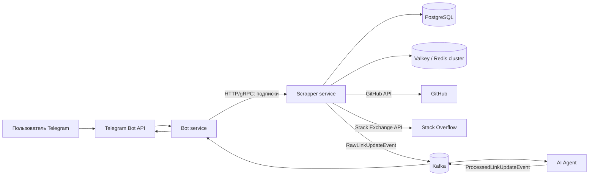

# Link Tracker

Link Tracker - это Telegram-бот и набор backend-сервисов для отслеживания обновлений в GitHub и Stack Overflow. Пользователь добавляет ссылку в боте, а система периодически проверяет источник, обрабатывает обновления и отправляет уведомления обратно в Telegram.

Проект сделан как микросервисное Java-приложение: Bot отвечает за Telegram-интерфейс, Scrapper хранит подписки и проверяет внешние API, AI Agent фильтрует/группирует/суммаризирует обновления, а общие HTTP/gRPC/Kafka-контракты лежат в `api-common`.

## Возможности

- Поддержка Telegram-команд: `/start`, `/help`, `/track`, `/untrack`, `/list`, `/cancel`.
- Отслеживание GitHub-репозиториев через GitHub Issues/Pull Requests API.
- Отслеживание вопросов Stack Overflow, включая новые ответы и комментарии.
- Теги для подписок и фильтрация списка ссылок командой `/list <tag>`.
- Доставка обновлений через Kafka с Avro-сообщениями и Schema Registry.
- gRPC и HTTP-клиенты между сервисами.
- Outbox-паттерн для надежной отправки уведомлений из Scrapper.
- Кеширование подписок через Valkey/Redis-кластер и локальный L1-кеш.
- Rate limiting, retry и circuit breaker на внешних и внутренних вызовах.
- AI Agent для фильтрации, приоритизации, группировки и краткого пересказа обновлений.

## Архитектура



### Модули

| Модуль | Назначение |
| --- | --- |
| `bot` | Telegram-бот, обработка команд, отправка уведомлений пользователям |
| `scrapper` | Управление чатами и подписками, проверка GitHub/Stack Overflow, outbox, кеширование |
| `ai-agent` | Kafka consumer/producer для фильтрации, группировки, приоритизации и суммаризации обновлений |
| `api-common` | OpenAPI, protobuf, Avro-схемы и сгенерированные общие DTO/API |

## Стек

- Java 25
- Spring Boot 4.0.2
- Maven 3.9.12
- PostgreSQL 17
- Liquibase
- Confluent Platform 8.2.0: Kafka + Schema Registry
- Avro
- gRPC / Protobuf
- OpenAPI / Springdoc
- Valkey 8.0 / Redis-compatible cluster
- Resilience4j
- WireMock
- Testcontainers

## Быстрый старт

### Требования

- JDK 25
- Docker и Docker Compose
- Telegram bot token от [@BotFather](https://t.me/BotFather)
- GitHub token
- Stack Exchange key и access token
- Hugging Face-compatible API token для AI Agent

### Запуск через Docker Compose

1. Создайте локальный `.env` из шаблона:

```powershell
Copy-Item .env.dist .env
```

Для Linux/macOS:

```bash
cp .env.dist .env
```

2. Заполните `.env`. Минимальный пример для Docker Compose:

```dotenv
DB_USER=linktracker
DB_PASSWORD=linktracker
DB_NAME=linktracker
DB_DRIVER=org.postgresql.Driver

TELEGRAM_TOKEN=<telegram-bot-token>
GITHUB_TOKEN=<github-token>
STACKOVERFLOW_KEY=<stackexchange-key>
STACKOVERFLOW_ACCESS_KEY=<stackexchange-access-token>

KAFKA_SCHEMA_REGISTRY_URL=http://schema-registry:8081

HF_API_URL=https://router.huggingface.co/v1/chat/completions
HF_TOKEN=<hf-token>
HF_MODEL=openai/gpt-oss-120b:fastest
```

3. Соберите и запустите проект:

```powershell
docker compose up --build -d
```

4. Проверьте, что контейнеры поднялись:

```powershell
docker compose ps
```

Для остановки окружения:

```powershell
docker compose down
```

Если нужно удалить и данные PostgreSQL/Valkey:

```powershell
docker compose down -v
```

### Локальный запуск из IDE или Maven

Поднимите инфраструктуру:

```powershell
docker compose up -d postgres liquibase-migrations kafka-1 kafka-2 kafka-3 schema-registry kafka-init valkey-1 valkey-2 valkey-3 valkey-init
```

Для локального запуска сервисов вне Docker используйте host-адреса:

```dotenv
DB_URL=jdbc:postgresql://localhost:5432/linktracker
KAFKA_BOOTSTRAP_SERVERS=localhost:19092,localhost:29092,localhost:39092
KAFKA_SCHEMA_REGISTRY_URL=http://localhost:8082
REDIS_CLUSTER_NODES=localhost:6379,localhost:6380,localhost:6381
APP_BOT_URL=http://localhost:8080
APP_SCRAPPER_URL=http://localhost:8081
APP_GRPC_HOST=localhost
SPRING_LIQUIBASE_ENABLED=true
```

Сгенерируйте общие контракты:

```powershell
.\mvnw.cmd -pl api-common -am generate-sources
```

Запустите сервисы в отдельных терминалах:

```powershell
.\mvnw.cmd -pl scrapper -am spring-boot:run
.\mvnw.cmd -pl ai-agent -am spring-boot:run
.\mvnw.cmd -pl bot -am spring-boot:run
```

Для Linux/macOS замените `.\mvnw.cmd` на `./mvnw`.

## Переменные окружения

| Переменная | Назначение |
| --- | --- |
| `DB_USER`, `DB_PASSWORD`, `DB_NAME`, `DB_DRIVER`, `DB_URL` | Подключение к PostgreSQL |
| `TELEGRAM_TOKEN` | Токен Telegram-бота |
| `GITHUB_TOKEN` | Токен для GitHub REST API |
| `STACKOVERFLOW_KEY`, `STACKOVERFLOW_ACCESS_KEY` | Доступ к Stack Exchange API |
| `REDIS_CLUSTER_NODES` | Узлы Valkey/Redis-кластера |
| `KAFKA_BOOTSTRAP_SERVERS` | Kafka bootstrap servers |
| `KAFKA_SCHEMA_REGISTRY_URL` | URL Confluent Schema Registry |
| `APP_BOT_URL`, `APP_SCRAPPER_URL`, `APP_GRPC_HOST` | Адреса внутренних сервисов |
| `SPRING_LIQUIBASE_ENABLED` | Включение Liquibase внутри приложения |
| `HF_API_URL`, `HF_TOKEN`, `HF_MODEL` | Настройки AI API для суммаризации |

## Порты

| Компонент | URL |
| --- | --- |
| Bot HTTP API | <http://localhost:8080> |
| Bot health | <http://localhost:8011/health> |
| Scrapper HTTP API | <http://localhost:8081> |
| Scrapper health | <http://localhost:8081/health> |
| AI Agent | <http://localhost:8083> |
| Schema Registry | <http://localhost:8082> |

Swagger UI доступен у HTTP-сервисов по пути `/swagger-ui/index.html`.

## API и контракты

### Scrapper API

OpenAPI-спецификация: [`api-common/src/main/resources/scrapper-api.yaml`](api-common/src/main/resources/scrapper-api.yaml)

| Метод | Endpoint | Описание |
| --- | --- | --- |
| `POST` | `/tg-chat/{id}` | Зарегистрировать Telegram-чат |
| `DELETE` | `/tg-chat/{id}` | Удалить Telegram-чат |
| `GET` | `/links` | Получить список отслеживаемых ссылок |
| `POST` | `/links` | Добавить ссылку в отслеживание |
| `DELETE` | `/links` | Убрать ссылку из отслеживания |

### Bot API

OpenAPI-спецификация: [`api-common/src/main/resources/bot-api.yaml`](api-common/src/main/resources/bot-api.yaml)

| Метод | Endpoint | Описание |
| --- | --- | --- |
| `POST` | `/updates` | Принять обновление ссылки и отправить уведомление в Telegram |

### gRPC

Protobuf-контракт: [`api-common/src/main/proto/linktracker.proto`](api-common/src/main/proto/linktracker.proto)

- `ScrapperService`: регистрация/удаление чата, добавление/удаление ссылок, получение списка ссылок.
- `BotService`: отправка обновления пользователю.

### Kafka / Avro

Avro-схемы:

- [`RawLinkUpdateEvent.avsc`](api-common/src/main/avro/RawLinkUpdateEvent.avsc)
- [`ProcessedLinkUpdateEvent.avsc`](api-common/src/main/avro/ProcessedLinkUpdateEvent.avsc)

Топики:

| Топик | Назначение |
| --- | --- |
| `link.raw-updates` | Сырые обновления от Scrapper |
| `link.raw-updates-dlt` | Dead-letter topic для сырых обновлений |
| `link.processed-updates` | Обработанные AI Agent обновления для Bot |
| `link.processed-updates-dlt` | Dead-letter topic для обработанных обновлений |

## Скриншоты

### Команды `/start` и `/help`


### Команда `/track` - начало отслеживания ссылки с тегами


### Команда `/list` - ссылки указаны вместе с привязанными тегами


### Уведомление об обновлении по ссылке


## Поддержка и контакты
Остались вопросы? Нужна помощь с настройкой? Нашли баг?

Email: **mairabeeva42@gmail.com** | Telegram: @arinkmm
