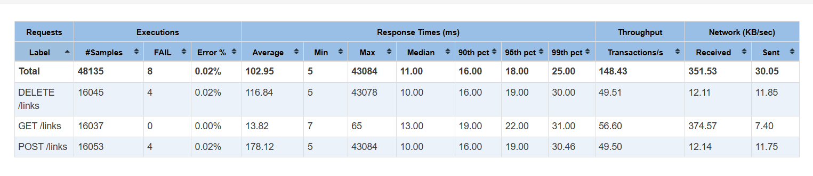
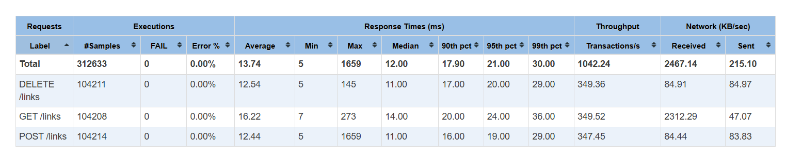
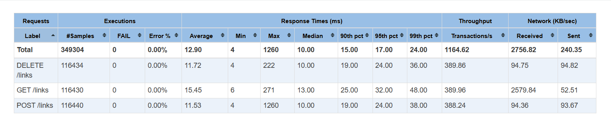

# LinkTracker

LinkTracker – Telegram-бот, который отслеживает изменения на веб-страницах и оперативно информирует пользователя о них.

---

## Как запустить

### 1. Заполнение переменных окружения

Найдите в корне проекта файл `.env.dist` и создайте рядом файл `.env` с вашими переменными из шаблона

### 2. Получение токена

Если у вас нет бота, создайте его в Telegram через [@BotFather](https://t.me/BotFather) и скопируйте полученный API Token

### 3. Настройка БД

Укажите username и password для подключения к бд, которая будет взаимодействовать с приложением, и само url на БД

### 4. Взаимодействие со сторонним API

Необходимо получить `github_token` для работы с Github API (https://docs.github.com/en/rest), а также для работы со StackOverflow API (https://api.stackexchange.com/) `stackoverflow_key` - публичный ключ для идентификации приложения и `stackoverflow_access_key` - токен доступа конкретного пользователя

Приложение готово к работе!

---

## Отчет о результатах нагрузочного тестирования

### Условия тестирования

Нагрузочное тестирование проводилось с помощью **Apache JMeter** для оценки эффективности различных стратегий кэширования в сервисе Scrapper.
*   **Количество потоков (Threads):** 16
*   **Ramp-up:** 60 секунд
*   **Длительность нагрузки:** 300 секунд
*   **Профиль нагрузки:** Смешанный (операции `GET`, `POST` и `DELETE` к эндпоинту `/links`)
*   **Объем данных:** Предварительно заполнено 100 000 ссылок (~100 на пользователя)

### Сводная таблица метрик (Total)

| Сценарий       | Тип кэширования          | Throughput (RPS) | Error %   | Avg Latency (ms) | 99th pct (ms) | Max Latency (ms) |
|:---------------|:-------------------------|:-----------------|:----------|:-----------------|:--------------|:-----------------|
| **Сценарий 1** | Без кэша                 | 148.43           | 0.02%     | 102.95           | 25.00         | 43 084           |
| **Сценарий 2** | **L1 + L2 (Near Cache)** | **1 042.24**     | **0.00%** | **13.74**        | **30.00**     | **1 659**        |
| **Сценарий 3** | **L2 (Redis)**           | **1 164.62**     | **0.00%** | **12.90**        | **24.00**     | **1 260**        |

---

### Анализ результатов

#### 1. Сценарий 1: Без кэширования

Показал минимальную пропускную способность (148.43 RPS) и наличие ошибок (0.02%). Основным ограничением является время отклика СУБД при конкурентных запросах, что приводит к критическому росту **Max Latency (43 сек)**

#### 2. Сценарий 2: L1 + L2 (Near Cache)

Внедрение двухуровневой системы на базе Caffeine (L1) и Redis (L2) позволило достичь стабильных **1 042.24 RPS**
*   **Производительность:** Среднее время отклика сократилось до **13.74 мс**, а максимальные задержки стабилизировались на уровне **1.6 сек** благодаря оптимизации объема объектов в Heap-памяти и настройке `l1Capacity`
*   **Архитектурный компромисс:** Незначительное снижение RPS относительно чистого Redis обусловлено накладными расходами на поддержку консистентности через Pub/Sub сообщения и десериализацию объектов для локального хранения. Однако это решение радикально снижает нагрузку на сетевой интерфейс и Redis-кластер

#### 3. Сценарий 3: L2 (Redis)

Продемонстрировал пиковую пропускную способность (**1 164.62 RPS**).
*   **Результаты:** Минимальное среднее время отклика (12.9 мс) и наиболее низкий 99-й перцентиль (24 мс).
*   **Преимущество:** Вынос кэша в отдельную инфраструктуру обеспечивает максимальную масштабируемость при минимальном потреблении ресурсов JVM приложения

---

### Итоговый вывод

Внедрение двухуровневого кэширования (L1+L2) признано наиболее сбалансированным решением. Несмотря на небольшую потерю в пиковом Throughput по сравнению с чистым Redis, данная конфигурация обеспечивает:
1.  **Снижение сетевого трафика:** Большая часть запросов на чтение обслуживается мгновенно из памяти приложения (L1)
2.  **Защиту инфраструктуры:** L1-слой выступает буфером, предотвращая перегрузку Redis-кластера при резких всплесках нагрузки
3.  **Стабильность:** Ограничение размера локального кэша и использование механизма инвалидации через Pub/Sub гарантируют отсутствие длительных пауз Garbage Collector при сохранении высокой актуальности данных
