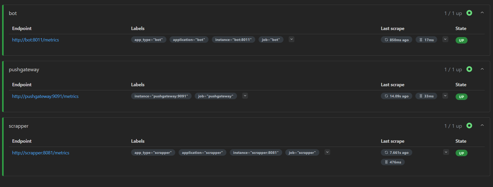
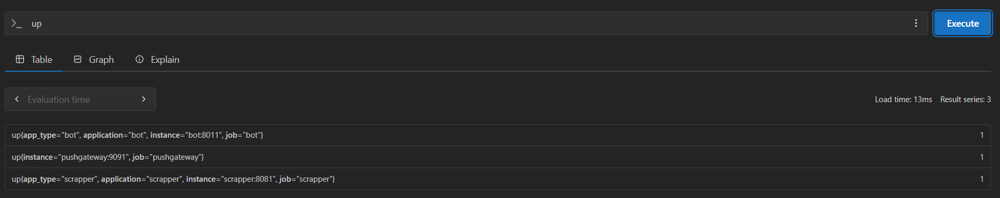
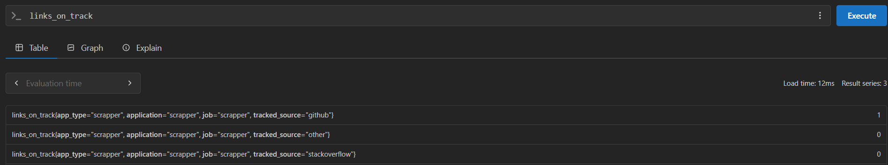
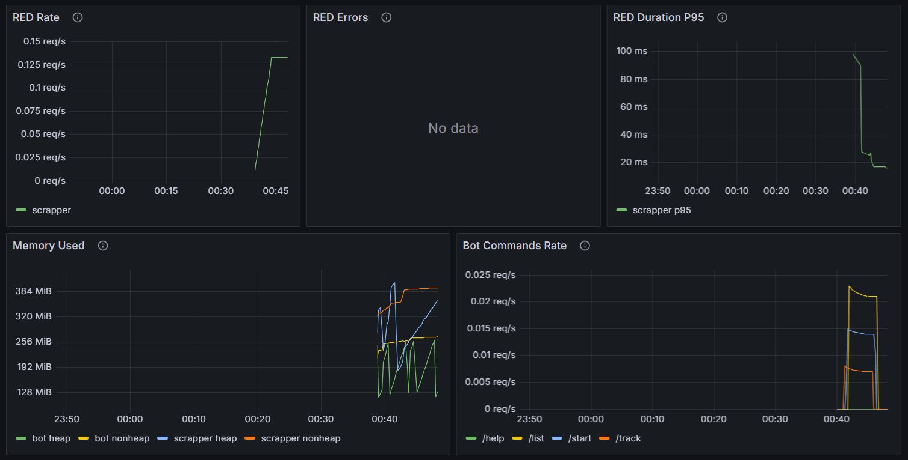
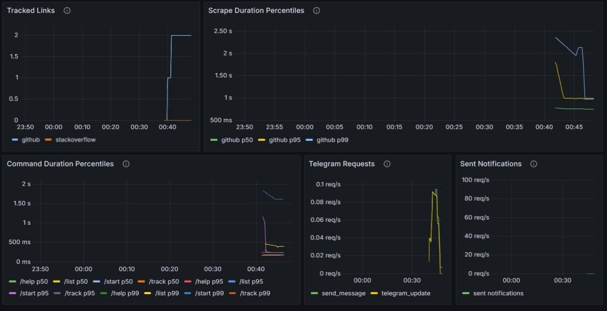
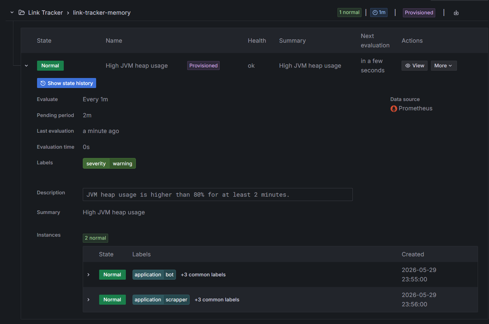

# Observability

## Запуск

Запустить приложения и инструменты мониторинга:

```powershell
docker compose up --build
```

Адреса:

|    Компонент     |              URL              |
|------------------|-------------------------------|
| Scrapper metrics | http://localhost:8081/metrics |
| Bot metrics      | http://localhost:8011/metrics |
| Prometheus       | http://localhost:9092         |
| Pushgateway      | http://localhost:9093         |
| Grafana          | http://localhost:3000         |

Вход в Grafana:

Если переменные `GRAFANA_ADMIN_USER` и `GRAFANA_ADMIN_PASSWORD` заданы в окружении, используются они

Dashboard:

```text
Dashboards -> Link Tracker Observability
```

## Метрики

### Scrapper

| Метрика               |    Тип    |        Лейблы         |                                     Описание                                      |
|-----------------------|-----------|-----------------------|-----------------------------------------------------------------------------------|
| `links_on_track`      | Gauge     | `tracked_source`      | Количество ссылок на мониторинге по источнику: `github`, `stackoverflow`, `other` |
| `request_duration_ms` | Histogram | `scope`, `scope_type` | Длительность операций Scrapper: БД, внешние источники, Kafka/AI Agent flow        |
| `api_requests_total`  | Counter   | `source`              | Количество входящих API-запросов в Scrapper                                       |

### Bot

|           Метрика     |    Тип    |              Лейблы              |               Описание               |
|-----------------------|-----------|----------------------------------|--------------------------------------|
| `command_requests_total` | Counter   | `command`, `request_type`        | Количество обработанных команд       |
| `command_duration_ms` | Histogram | `command`, `scope`, `scope_type` | Длительность обработки команд        |
| `telegram_requests_total` | Counter   | `request_type`                   | Количество запросов/событий Telegram |
| `sent_notification_total` | Counter   | -                                | Количество отправленных уведомлений  |

### Стандартные

|                Метрика                |               Описание               |
|---------------------------------------|--------------------------------------|
| `http_server_requests_seconds_count`  | Количество HTTP-запросов             |
| `http_server_requests_seconds_bucket` | Histogram длительности HTTP-запросов |
| `jvm_memory_used_bytes`               | Используемая JVM-память              |
| `jvm_memory_max_bytes`                | Максимально доступная JVM-память     |
| `up`                                  | Доступность scrape target            |

## PromQL

### RED-Метрики

Request rate:

```promql
sum by (application) (rate(http_server_requests_seconds_count{application=~"$application", app_type=~"$app_type"}[5m]))
```

Errors:

```promql
sum by (application) (rate(http_server_requests_seconds_count{application=~"$application", app_type=~"$app_type", status=~"5.."}[5m]))
```

Duration p95:

```promql
histogram_quantile(0.95, sum by (le, application) (rate(http_server_requests_seconds_bucket{application=~"$application", app_type=~"$app_type"}[5m])))
```

### Память

```promql
sum by (application, area) (jvm_memory_used_bytes{application=~"$application", app_type=~"$app_type"})
```

### Пользовательские Команды

```promql
sum by (command) (rate(command_requests_total{application=~"$application"}[5m]))
```

### Активные Ссылки

```promql
links_on_track{application=~"$application", tracked_source=~"github|stackoverflow"}
```

### Scrape Duration P50/P95/P99

```promql
histogram_quantile(0.50, sum by (le, scope_type) (rate(request_duration_ms_bucket{application=~"$application", scope="external_source"}[5m])))
```

```promql
histogram_quantile(0.95, sum by (le, scope_type) (rate(request_duration_ms_bucket{application=~"$application", scope="external_source"}[5m])))
```

```promql
histogram_quantile(0.99, sum by (le, scope_type) (rate(request_duration_ms_bucket{application=~"$application", scope="external_source"}[5m])))
```

### Bot Command Duration P50/P95/P99

```promql
histogram_quantile(0.50, sum by (le, command) (rate(command_duration_ms_bucket{application=~"$application"}[5m])))
```

```promql
histogram_quantile(0.95, sum by (le, command) (rate(command_duration_ms_bucket{application=~"$application"}[5m])))
```

```promql
histogram_quantile(0.99, sum by (le, command) (rate(command_duration_ms_bucket{application=~"$application"}[5m])))
```

### Telegram Requests

```promql
sum by (request_type) (rate(telegram_requests_total{application=~"$application"}[5m]))
```

### Sent Notifications

```promql
sum(rate(sent_notification_total{application=~"$application"}[5m]))
```

### Memory Alert

```promql
sum(jvm_memory_used_bytes{area="heap"}) by (application) / sum(jvm_memory_max_bytes{area="heap"}) by (application)
```

### Pushgateway

```promql
up{job="pushgateway"}
```

## Скриншоты

Места для скриншотов в MR:

### Prometheus Targets



### PromQL Queries





### Grafana Dashboard





### Grafana Alert


